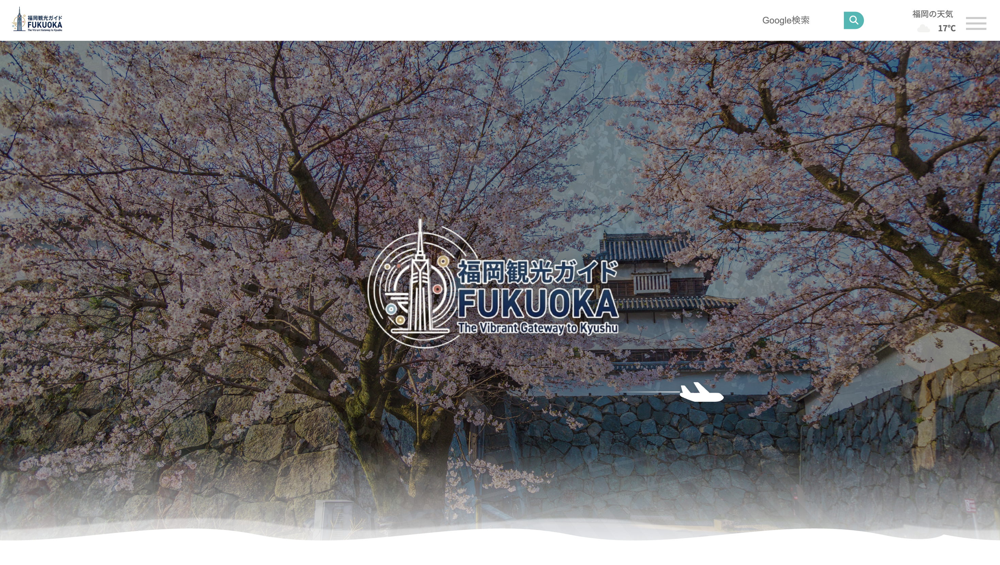
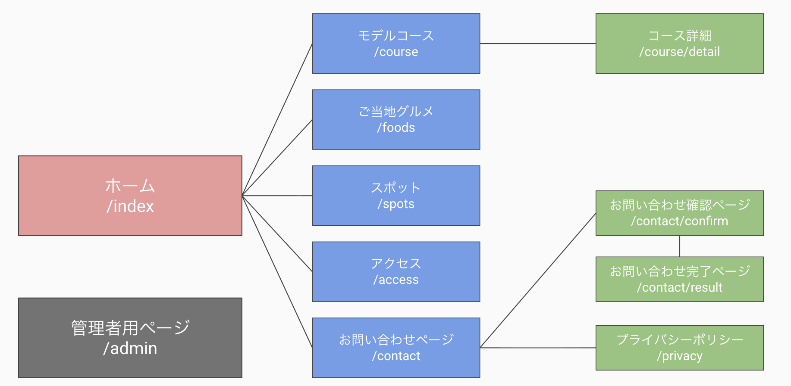
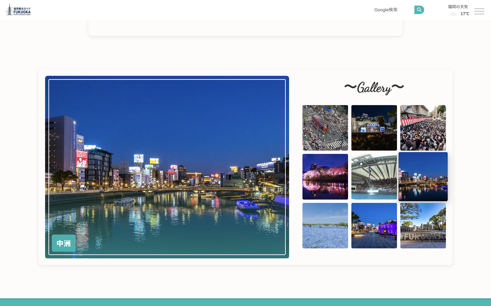
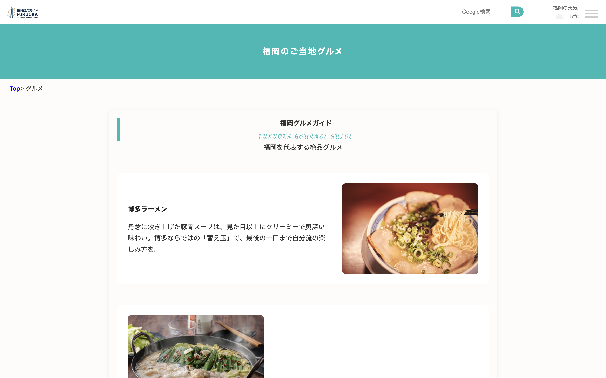
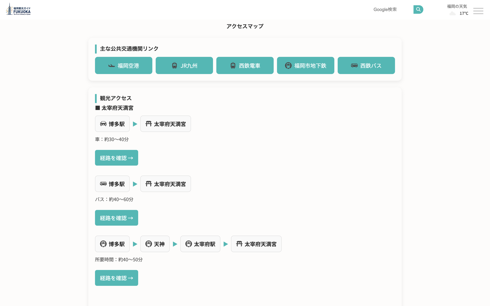
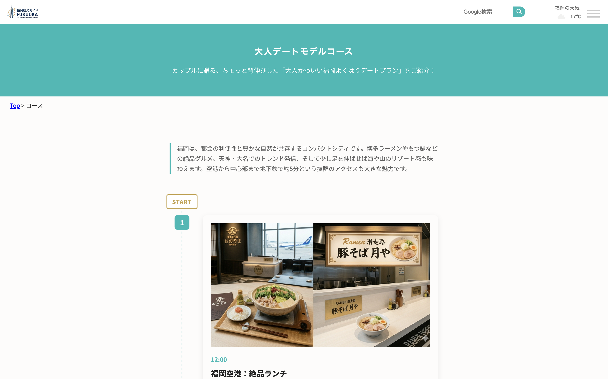
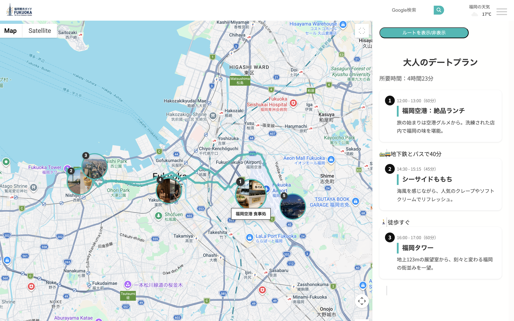
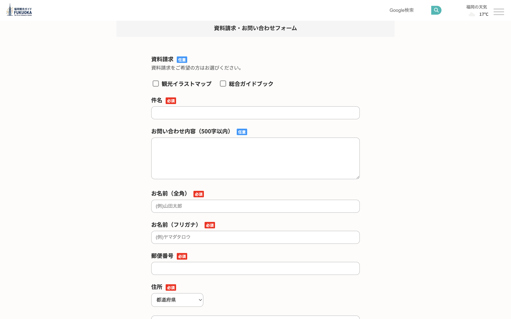

# fukuoka-travel

グループワークで作成した福岡県の観光サイトです。

## 🔗 Live Demo
https://kankou-project.onrender.com/

## 🌐 アプリ概要
この福岡観光サイトは県外の方に福岡県の魅力を知って興味を持って貰い実際に訪れてもらう足掛かりとなることをコンセプトとして作成しました。
20代後半女性をペルソナとし、カップルで訪れる大人のデートをパーソナライズしました。

## 🔐 主な機能
- 福岡県の観光スポット閲覧
- 現地天気情報の取得
- モデルコース表示
- GoogleMap連携
- お問い合わせ送信
- 管理画面での問い合わせ管理

## ☁️ インフラ構成
本番環境はRender + AWS S3 + PostgreSQLで構成しています。

## 🎨 UI / UX
シンプルで直感的なUI設計
アイコンを多用することで視認性を高める
Webフォントや少ない色使いに厳選することでまとまりを出しました

## 🛠 技術スタック

| Category | Technology |
|---|---|
| Backend | Flask |
| Database | PostgreSQL |
| Frontend | HTML / CSS / JavaScript |
| Infrastructure | Render / AWS S3 |
| Tools | Git / GitHub |

## フレームワーク

## 🚀 セットアップ方法
git clone https://github.com/miraisato-dev/fukuoka-travel.git
cd fukuoka-travel
pip install -r requirements.txt
flask run
ブラウザで以下にアクセス：
http://localhost:5000

## 🎯 開発背景
福岡県外の方に、観光地だけでなく
「旅行体験そのもの」の魅力を感じてもらえるサイトを目指しました。

単なる情報掲載ではなく、
現地天気・モデルコース・アクセス導線を組み合わせ、
旅行計画までイメージできる構成を意識しました。

## 💡 工夫した点
## UI / UX
- 福岡の景色を活かしたスライダーやアニメーションを実装
- 少ない色数とWebフォントで統一感のあるデザインに調整
- PCではhover、スマホではタップ操作に切り替え、デバイスごとの操作性を意識
## 観光体験を意識した設計
- 現地の天気情報を取得し、旅行計画を立てやすくした
- GoogleMap連携により、アクセス確認をスムーズにした
- モデルコースを用意し、実際の旅行イメージが湧く構成にした
## お問い合わせ機能
- WTFormsによるバリデーションを実装
- 確認画面・自動返信メール・DB保存に対応
- 管理画面から問い合わせ状況を管理可能

## 👨‍💻 担当領域

グループ開発では主に以下を担当しました。

- HTML/CSSで作成された画面のFlask化
- app.py のルーティング実装
- 各ページのFlaskテンプレート化・マクロ化
- コース詳細ページの実装
- GoogleMap連携機能の実装
- 問い合わせ機能の統合・動作確認

## 📌 使用技術詳細
- Flask
- Jinja2
- WTForms
- PostgreSQL
- Render
- AWS S3
- JavaScript
- Google Maps API
- OpenWeather API

## 🔮 今後の改善予定
お知らせや掲載情報をHTMLに直接書くのではなく後々修正可能なように保守性を高めることその際DBを取り入れること
adminページの拡張
ページ数とコンテンツの幅を広げる
app.pyにすべてを入れ込んでいるため今後増える場合は関数は分けたりBluePrintを利用する

## 📸 スクリーンショット
### TOPページ

### スポットページ/グルメページ 

### アクセスページ 

### モデルコースページ 

### コース詳細ページ

### お問い合わせページ

## 👨‍💻 作者
miraisato-dev GitHub: https://github.com/miraisato-dev
